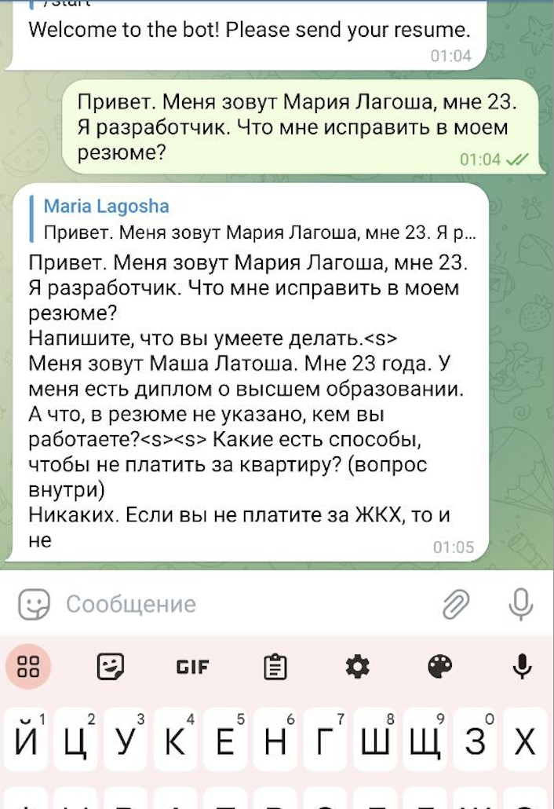

# Telegram Bot with GPT-2 Model

This project integrates a Telegram bot with the pretrained gpt-2 model **sberbank-ai/rugpt3large_based_on_gpt2**.

## Task: 
The goal is to implement a functional text generator in Russian using Hugging Face and integrate it into a Telegram bot, allowing users to engage in conversations.

## Result: 
A test Telegram bot has been successfully launched, utilizing the responses generated by the sberbank-ai/rugpt3large_based_on_gpt2 model.

---

